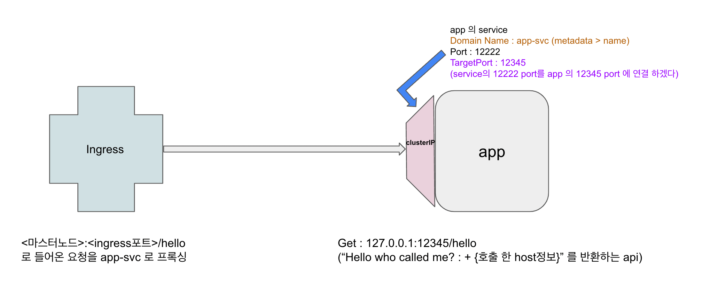

### pod 하나 띄우고 서비스(clusterIP) 연결. 그 서비스에 ingress를 연결한 뒤 외부에서 pod에 쿼리 날리기 위해 ingress에 쿼리를 날린다.   
   
1. app-svc.yml 을 복붙 & apply 해 pod, 서비스(clusterIP) 띄움
2. app-ing.yml 을 복붙 & apply 해 서비스에 ingress 연결
3. master node 의 public ip 를 이용해 <마스터노드IP>:<ingress포트>/hello 로 쿼리
4. mac 의 /etc/hosts 파일 수정해 temp.com 이 마스터노드IP 를 바라보도록 변경
5. temp.com/hello 로 pod 에 쿼리

