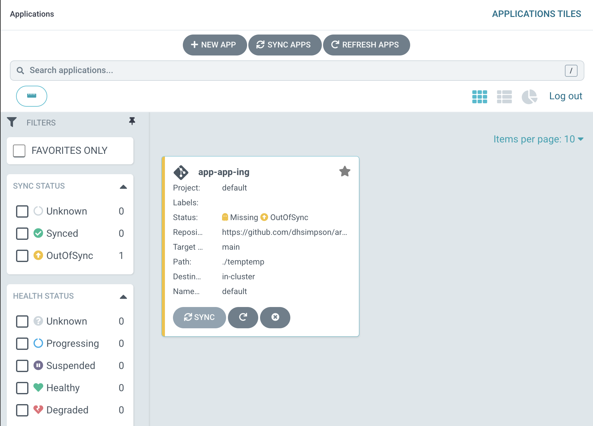
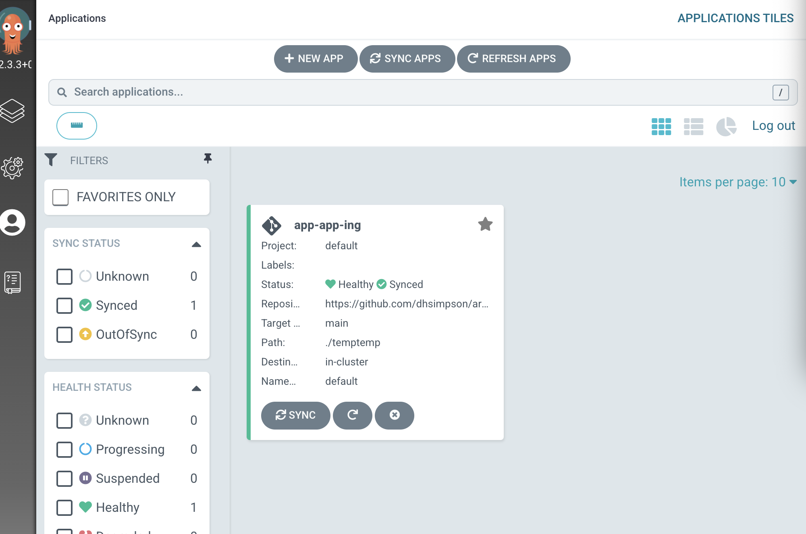

### ArgoCD 설치하기
1. k8s에 ArgoCD 설치 ->    kubectl create namespace argocd   
kubectl apply -n argocd -f https://raw.githubusercontent.com/argoproj/argo-cd/stable/manifests/install.yaml
2. argocd-server 를 insecure 하게 만들기 (tls인증서 요구 무시) -> kubectl patch deployment -n argocd argocd-server --patch-file no-tls.yml 
3. ingress 설치 01. - baremetal ingress-nginx > kubectl apply -f https://raw.githubusercontent.com/kubernetes/ingress-nginx/controller-v1.1.3/deploy/static/provider/baremetal/deploy.yaml
4. ingress 설치 02. - 인증 관련 오류 제거 > kubectl delete validatingwebhookconfiguration ingress-nginx-admission
4. ingress 추가하기 -> kubectl apply -n argocd -f argocd-ing.yml
5. 내 PC (ex mac or windows) 의 hosts file 에 <master 노드 public IP 주소>   argocd.example.com 추가하기
6. ingress-nginx 컨트롤러의 https 포트 확인 -> kubectl get svc -n ingress-nginx
7. 웹 브라우저에 https://<argocd.example.com>:<ingress-nginx-컨트롤러의-https-포트> 로 들어가기
8. 주의 메시지가 나온다면 무시하고 들어가기
9. 다음 명령어로 argocd 의 admin 계정 패스워드 확인하기 (id : admin) > kubectl -n argocd get secret argocd-initial-admin-secret -o jsonpath="{.data.password}" | base64 -d
10. userinfo 에 들어가 비밀번호 변경 하기 https://<argocd.example.com>:<ingress-nginx-컨트롤러의-https-포트>/user-info
(update password 클릭 -> 비번 변경 -> save new password)   
 

### ArgoCD 이용해 CD(지속적 배포) 하기
1. create app 클릭하기 
2. application name, project 는 알아서 채워 넣기 
3. Repository URL 은 배포 대상 yml 파일의 저장소 주소 (실습에선 https://github.com/dhsimpson/argocd_temp_repo)   
   Revision 은 branch 로 선택한 뒤 실습 대상 레포지토리의 브랜치인 main 을 적음   
   Path 는 배포 대상 yml 파일이 위치하는 디렉터리 경로 (실습에선 깃헙 레포의 /temptemp 디렉터리 사용할 것이므로 ./temptemp 로 함. "./" 가 깃헙 레포지토리의 root 경로)   
   
4. manual sync 로 셋팅돼 있으므로 sync 눌러 줘야 yml 파일 대로 apply 할 것임 
5.  sync 완료 된 결과 

