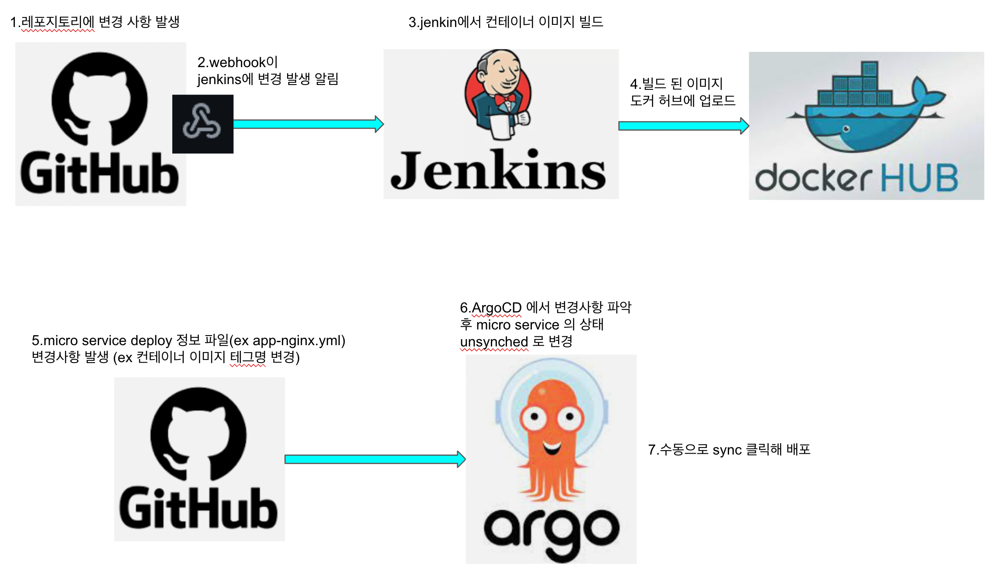

   

   
1. 예시 app url : [jenkins-test-node-app](https://github.com/dhsimpson/jenkins_test_node_app)
2. 예시 CD url : [cd-repo](https://github.com/dhsimpson/argocd_temp_repo)
3. argocd 에서 cd-repo 의 cicd-test-app 경로에 대해 지속적 배포 수행하도록 new app 생성
4. 생성한 app에 request 날려 메시지 확인
5. 예시 app 의 response 메시지를 업데이트 시켜 새로운 테그명을 가진 컨테이너 이미지 CI(지속적 빌드)
6. cicd-test-app 경로의 yml 파일에서 새로운 테그명으로 수정
7. argoCD 에서 unsync 상태 확인 및 sync를 눌러 CD(지속적 배포)
8. 업데이트 된(CICD가 성공 한) app에 request 날려 메시지가 변경한 것을 확인
